# Guidance for Improving Application Development Productivity with the SAP ABAP Assistant on AWS

## Table of Content 

- [Guidance for Improving Application Development Productivity with the SAP ABAP Assistant on AWS](#guidance-for-improving-application-development-productivity-with-the-sap-abap-assistant-on-aws)
  - [Table of Content](#table-of-content)
  - [Overview](#overview)
    - [Architecture](#architecture)
      - [With IAM Identity Center](#with-iam-identity-center)
      - [With IAM Roles Anywhere](#with-iam-roles-anywhere)
    - [Cost](#cost)
    - [Sample Cost Table](#sample-cost-table)
  - [Prerequisites](#prerequisites)
    - [Operating System](#operating-system)
    - [Third-party tools](#third-party-tools)
    - [AWS account requirements](#aws-account-requirements)
    - [AWS Command Line Interface (AWS CLI)](#aws-command-line-interface-aws-cli)
  - [Deployment Steps](#deployment-steps)
  - [Deployment Validation](#deployment-validation)
  - [Setup](#setup)
    - [Authentication](#authentication)
      - [Using IAM Identity Center for authentication](#using-iam-identity-center-for-authentication)
      - [Using IAM Roles Anywhere for authentication](#using-iam-roles-anywhere-for-authentication)
    - [Plugin Installation](#plugin-installation)
    - [Plugin Configuration](#plugin-configuration)
  - [Running the Guidance](#running-the-guidance)
    - [Generate ABAP Documentation](#generate-abap-documentation)
    - [Generate ABAP Code](#generate-abap-code)
  - [Next Steps](#next-steps)
  - [Cleanup](#cleanup)
    - [Uninstall SAP ABAP Assistant Plugin](#uninstall-sap-abap-assistant-plugin)
    - [AWS resources](#aws-resources)
  - [Notices](#notices)
  - [Authors](#authors)

## Overview

SAP customers are embarking on digital transformation projects, including RISE with SAP. To accelerate and de-risk transformation projects, customers want to understand ABAP programs in their SAP systems to assess the impact on business processes. Understanding existing custom code can be challenging for several reasons: 1/ lack of quality documentation for ABAP programs, 2/ unavailability of resources that built the custom code, and 3/ lack of resources needed to review and understand the legacy custom code. Also, ABAP developers spend significant time searching the existing codebase and forums for code snippets to incorporate into the ABAP programs. These challenges reduce productivity and impact project deadlines.

With the SAP ABAP Assistant using Amazon Bedrock, SAP customers can accelerate delivery of new ABAP code by generating code snippets with natural language prompts, and generate documentation for custom and standard ABAP programs, improving productivity and accelerating transformation.

This sample code consists of the SAP ABAP Assistant Eclipse plugin release and its source code.

### Architecture

#### With IAM Identity Center


1. **Install AWS Command Line Interface (AWS CLI) v2:** SAP ABAP Developer installs AWS CLI v2 in Windows or Mac and configures the AWS CLI to authenticate with the AWS IAM Identity Center using `aws configure sso` command.

2. **Authentication:** SAP ABAP Developer authenticates with the AWS IAM Identity Center using the AWS CLI with `aws sso login --profile <profile-name>` command.

3. **Install SAP ABAP Assistant Plugin:** SAP ABAP developer downloads, installs and configures the SAP ABAP Assistant plugin in Eclipse Integrated Development Environment (IDE) .

4. **Invoke SAP ABAP Assistant:** SAP ABAP Developer authenticates and connects one or more SAP system hosted in AWS VPC or on-premises or SAP Business Technology Platform (BTP) ABAP environment to Eclipse IDE. 
The developer opens an ABAP program in Eclipse IDE, and selects a block of ABAP code for which the documentation has to be generated. For code generation, the developer writes prompt in simple English in the ABAP program. The developer invokes SAP ABAP Assistant plugin using “Ask Bedrock” menu in Eclipse IDE.

5. **Invoke Foundation Model:** The SAP ABAP Assistant plugin sends a request with the selected prompts or ABAP code to Amazon Bedrock to call large language models (LLMs) hosted by Amazon Bedrock, such as the Anthropic’s Claude model to produce ABAP code or documentation.

6. **Response Generation:** The SAP ABAP Assistant returns the response back to the ABAP editor in case of code generation or displays documentation in a console in Eclipse IDE. The developer will validate the generated code and if required, modify it to the specific use case.

#### With IAM Roles Anywhere


1. **Install SAP ABAP Assistant Plugin:** The SAP ABAP developer downloads the provided SAP ABAP Assistant plugin, then installs and configures the plugin in Eclipse IDE.
   
2. **Invoke SAP ABAP Assistant:** The SAP ABAP developer authenticates and connects one or more SAP systems hosted in Amazon VPC, on-premises, or the SAP Business Technology Platform (BTP) ABAP environment to Eclipse IDE. The developer opens an ABAP program in Eclipse IDE and selects a block of ABAP code for which the documentation has to be generated. For code generation, the developer writes a prompt in simple English in the ABAP program. The developer invokes SAP ABAP Assistant plugin using the “Ask Bedrock” menu in Eclipse IDE.

3. **Authentication:** The SAP ABAP Assistant plugin sends a request to AWS Identity and Access Management (IAM) Roles Anywhere to generate temporary credentials using X.509 certificate issued by AWS Private Certificate Authority (AWS Private CA). 

    IAM Roles Anywhere works by bridging the trust model of AWS Identity and Access Management (IAM) and public key infrastructure (PKI). The model connects the role, the IAM Roles Anywhere service principal, and identities encoded in X.509 certificates, that are issued by a certificate authority.
 

4. **Invoke Foundation Model:** The SAP ABAP Assistant plugin sends a request with the selected prompts or ABAP code to Amazon Bedrock to call LLMs hosted by Amazon Bedrock, such as the Anthropic’s Claude model to produce ABAP code or documentation.

5. **Response Generation:** The SAP ABAP Assistant plugin returns the response back to the ABAP editor in case of code generation or displays documentation in a console in Eclipse IDE. The developer will validate the generated code and, if required, modify it to the specific use case. 
   
### Cost

_We recommend creating a [Budget](https://docs.aws.amazon.com/cost-management/latest/userguide/budgets-managing-costs.html) through [AWS Cost Explorer](https://aws.amazon.com/aws-cost-management/aws-cost-explorer/) to help manage costs. Prices are subject to change. For full details, refer to the pricing webpage for each AWS service used in this Guidance._

### Sample Cost Table

The following table provides a sample cost breakdown for deploying this Guidance with the default parameters in the US East (N. Virginia) Region

**On-Demand pricing (US regions)**

| AWS service  | Price per 1,000 input tokens [USD] | Price per 1,000 output tokens [USD] |
| ------------ | ----------------------------------| --------------------------------- |
| Amazon Bedrock - Claude 3.7 Sonnet    | $0.003 | $0.015 |
| Amazon Bedrock - Claude 3.5 Sonnet    | $0.003 | $0.015 |
| Amazon Bedrock - Claude 3 Sonnet      | $0.003 | $0.015 |
| Amazon Bedrock - Claude 3.5 Haiku     | $0.0008 | $0.004 |
| Amazon Bedrock - Claude 3 Haiku       | $0.00025 | $0.00125 |
| Amazon Bedrock - Claude 3 Opus        | $0.015 | $0.075 |
| Amazon Bedrock - Llama 3.1 Instruct (405B)        | $0.0024 | $0.0024	|

## Prerequisites

### Operating System
You can use SAP ABAP Assistant plugin in **Eclipse IDE** on **MacOS** or **Windows** Operating System

### Third-party tools

1. Install [Eclipse IDE](https://www.eclipse.org/downloads/packages/) with version 2023-09 (4.29.0) and above
2. Install [ABAP Development tools for Eclipse](https://tools.hana.ondemand.com/#abap)
3. Create an [ABAP project in Eclipse IDE](https://help.sap.com/docs/abap-cloud/abap-development-tools-user-guide/abap-project?version=sap_btp) to connect with the ABAP system

### AWS account requirements

For this guidance, we will be using the `us-east-1` region.

1. For AWS IAM Identity Center authentication, enable [AWS IAM Identity Center](https://docs.aws.amazon.com/singlesignon/latest/userguide/get-set-up-for-idc.html) with AWS Organizations. Make a note of the **Instance ARN** and **AWS Access portal URL** from the **Settings** page of IAM Identity Center.


2. For IAM Roles Anywhere authentication, you must use the X.509 certificates issued by your [certificate authority (CA)](https://docs.aws.amazon.com/privateca/latest/userguide/PcaTerms.html#terms-ca). Establish trust between IAM Roles Anywhere and your certificate authority (CA) by creating a trust anchor. A profile must be created to specify the roles and policies that IAM Roles Anywhere would assume. For more information see [Creating a trust anchor and profile in AWS Identity and Access Management Roles Anywhere](https://docs.aws.amazon.com/rolesanywhere/latest/userguide/getting-started.html).

3. [Access to Amazon Bedrock foundation model](https://docs.aws.amazon.com/bedrock/latest/userguide/model-access.html): Request access to supported foundation models from from the Amazon Bedrock console in your AWS account. The following foundation models are supported:
   *  Anthropic Claude 3.7 Sonnet
   *  Anthropic Claude 3.5 Sonnet V2
   *  Anthropic Claude 3.5 Sonnet
   *  Anthropic Claude 3.5 Haiku
   *  Anthropic Claude Opus
   *  Anthropic Claude 3 Sonnet
   *  Anthropic Claude 3 Haiku
   *  Anthropic Claude V2.1
   *  Anthropic Claude V2
   *  Meta Llama 3.1 405B
  
### AWS Command Line Interface (AWS CLI)

Install [AWS Command Line Interface v2](https://docs.aws.amazon.com/cli/latest/userguide/getting-started-install.html) . To confirm the installation, open your preferred terminal and enter `aws --version` command 

```
C:\> aws --version
aws-cli/2.15.30 Python/3.11.6 Windows/10 exe/AMD64 prompt/off
```
## Deployment Steps

1. Clone the GitHub repository to access the AWS CloudFormation deployment template.
```
git clone https://github.com/aws-solutions-library-samples/guidance-for-improving-application-development-productivity-with-the-sap-abap-assistant-on-aws.git
cd ./guidance-for-improving-application-development-productivity-with-the-sap-abap-assistant-on-aws
```

2. Deploy the AWS CloudFormation Stack
This guidance utilizes the `AdministratorAccess` role for deployment. For use in a production environment, refer to the [security best practices](https://docs.aws.amazon.com/IAM/latest/UserGuide/best-practices.html) in the AWS Identity and Access Management (IAM) documentation and modify the IAM roles as needed.

* Sign in to the [AWS CloudFormation console](https://console.aws.amazon.com/cloudformation/home)
* Create Stack > Upload the `guidance-for-improving-application-development-productivity-with-the-sap-abap-assistant-on-aws/deployment/prereq-sap-abap-assistant-on-aws.yml` file
* Input the following values:
    * Select the authentication option of your choice in the **Authentication option** parameter. Fill in the corresponding section as per the chosen authentication mechanism. 
    * For **IAM Identity Center** authentication option, enter the following values: 
        * Enter `sap-abap-assistant` in the stack name
        * For **InstanceArn** parameter, enter the Instance ARN of AWS IAM Identity Center
        * The **PermissionSetName** parameter is populated with the value `ABAPAssistantAccess`
        * The **SessionDuration** parameter is populated with the value `PT8H`
    * For **IAM Roles Anywhere** authentication option, enter the following values:
        * Enter `ABAPAssistantRole` in the IAM Role Name

* Deploy the CloudFormation stack

## Deployment Validation

* Open the AWS CloudFormation console and verify the status of the stack deployment with the name starting with `sap-abap-assistant`.
* If deployment is successful, you should see a permission set with the name `ABAPAssistantAccess` in the AWS IAM Identity Center.
* [Optional] - You can see the detailed output in the AWS CloudFormation Stack `sap-abap-assistant` using below AWS CLI command.
    ```
    aws cloudformation describe-stacks --stack-name sap-abap-assistant --query 'Stacks[0].Outputs' --output table --no-cli-pager
    ```

## Setup

### Authentication
#### Using IAM Identity Center for authentication
As per the [identity source](https://docs.aws.amazon.com/singlesignon/latest/userguide/manage-your-identity-source.html) configured in your IAM Identity Cetner, [assign permission set](https://docs.aws.amazon.com/singlesignon/latest/userguide/set-up-single-sign-on-access-to-accounts.html) created above to the user or group in IAM Identity Center.

1. Open your preferred terminal in MacOS or Windows Operating System to run the AWS CLI commands

2. Enter the command `aws configure sso` to create the SSO token provider configuration.

     ```
    $ aws configure sso
    SSO session name (Recommended): abap-assistant-sso
    SSO start URL [None]: https://enter-your-sso-start-url.awsapps.com/start
     SSO region [None]: us-east-1
    SSO registration scopes [None]: sso:account:access
    ```
3. The AWS CLI attempts to open your default browser and begin the login process for your IAM Identity Center account.

4. The AWS CLI displays the AWS accounts available for you to use. Use the arrow keys to select the account you want to use. If you are authorized to use only one account, the AWS CLI selects that account for you automatically and skips the prompt.
    ```
    There are 2 AWS accounts available to you.
    > DeveloperAccount, developer-account-admin@example.com (123456789011) 
    ProductionAccount, production-account-admin@example.com (123456789022)
    ```
5. The AWS CLI confirms your account choice, and displays the IAM roles that are available to you in the selected account. Use the arrow keys to select the IAM role `ABAPAssistantAccess` and press \<ENTER\>. If the selected account lists only one role, the AWS CLI selects that role for you automatically and skips the prompt.
    ```
    Using the account ID 123456789011
    There are 2 roles available to you.
    > ReadOnly
    ABAPAssistantAccess
    ```
6. Specify the default output format, the default AWS Region to send commands to, and provide a name as `abap-assistant` for the profile so you can reference this profile from Eclipse plugin.

    ```
    CLI default client Region [None]: us-east-1
    CLI default output format [None]: json
    CLI profile name [ABAPAssistantAccess-123456789011]: abap-assistant
     ```

7. A final message describes the completed profile configuration.

    ```
    To use this profile, specify the profile name using --profile, as shown:

    aws s3 ls --profile abap-assistant
     ```
8. This results in creating the sso-session section with the name `abap-assistant-sso` and named profile with the name `abap-assistant` in the config file located at ~/.aws/config on macOS, or at C:\Users\USERNAME\\.aws\config on Windows.

     ```
    [profile abap-assistant]
    sso_session = abap-assistant-sso
    sso_account_id = 123456789011
    sso_role_name = ABAPAssistantAccess
    region = us-east-1
    output = json
                
    [sso-session abap-assistant-sso]
    sso_start_url = https://enter-your-sso-start-url.awsapps.com/start
    sso_region = us-east-1
    so_registration_scopes = sso:account:access
    ``` 

9. To reauthenticate after the session expiry, you need to use the following command.
    ```
    aws sso login --profile abap-assistant
    ```
#### Using IAM Roles Anywhere for authentication
Follow the below steps to create a PKCS #12 certificate which bundles the private key and X.509 certificate. Here we are using AWS Private CA for generating the X.509 certificate. If you want to use external CA certificate, see [IAM Roles Anywhere with an external certificate authority](https://aws.amazon.com/blogs/security/iam-roles-anywhere-with-an-external-certificate-authority/)

1. Generate a new private key
    ```
    openssl genrsa -out private-key.pem 2048
    ```
2. Create a Certificate Signing Request (CSR) using the private key
   ```
    openssl req -new -key private-key.pem -out certificate.csr \
        -subj "/C=US/ST=YourState/L=YourCity/O=YourOrganization/CN=YourCommonName"
   ```

3. Use AWS Private CA to issue a certificate using the CSR.
    ```
        aws acm-pca issue-certificate \
            --certificate-authority-arn <your-ca-arn> \
            --csr fileb://certificate.csr \
            --signing-algorithm "SHA256WITHRSA" \
            --validity Value=365,Type="DAYS"
    ```

4. Get the issued certificate using AWS CLI
    ```
    aws acm-pca get-certificate \
        --certificate-authority-arn <your-ca-arn> \
        --certificate-arn <certificate-arn> \
        --output text > certificate.pem
    ```
    **NOTE** - Open the generated certificate.pem in any text editor. A `TAB` character is inserted between the two certificate pieces. Remove the `TAB` character and press `ENTER`.

5. Create a .p12 certificate with private key and certificate
    ```
    openssl pkcs12 -export \
        -in certificate.pem \
        -inkey private-key.pem \
        -out cert_combined.p12 \
        -name "abap_assistant"
    ```
    Make a note of the value of `-name` parameter which is the alias for the certificate in PKCS#12 store. This will be used later in the ABAP Assistant configuration. 
    
    Also, make a note of the Export password used in this step. This will be required when you execute the next command. 

6. Create a keystore
    ```
    keytool -importkeystore \
        -srckeystore cert_combined.p12 \
        -srcstoretype PKCS12 \
        -destkeystore pkcs_cert.p12 \
        -deststoretype PKCS12
    ```
    The certificate (pkcs_cert.p12) will be used later in the ABAP Assistant configuration. Make a note of the destination keystore password entered while running this command. This will be used later in the ABAP Assistant configuration.

7. (Optional step) To verify keystore contents
    ```
    keytool -list -v -storetype PKCS12 -keystore pkcs_cert.p12
    ```

### Plugin Installation
1. From the main page of the GitHub repository, click **[Releases](https://github.com/aws-solutions-library-samples/guidance-for-improving-application-development-productivity-with-the-sap-abap-assistant-on-aws/releases)** . From the latest listed release, download the SAP ABAP Assistant plugin zip file (for e.g. sap-abap-assistant-V1_0_19.zip) from the **Assets** section. Save the plugin zip file in your local file system.

2. Open Eclipse IDE and choose **Help -> Install New Software**. Choose the **Add…** button. In the next dialog window, choose **Archive…** and select the zip file that you downloaded. Choose **Add**.

    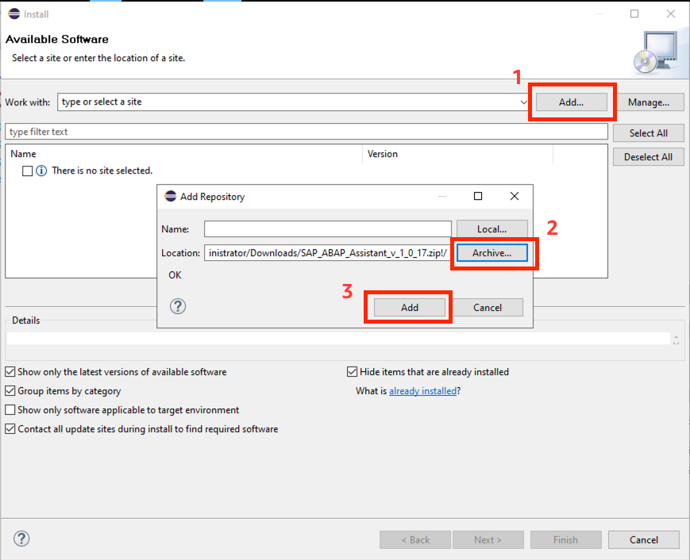

3. Uncheck the option **Group items by category**. You will see SAP ABAP Assistant plugin listed along with the version number Select the plugin and choose **Next**

    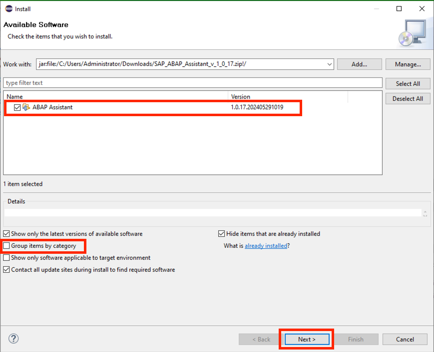

4. In the subsequent windows, choose **Next**, and accept the terms of the license agreement and choose **Finish**. Eclipse will start the installation of plugin. You can see the status of installation at the bottom right corner of the Eclipse IDE. Eclipse will prompt to trust the artifacts. Choose **Trust Selected**. 

    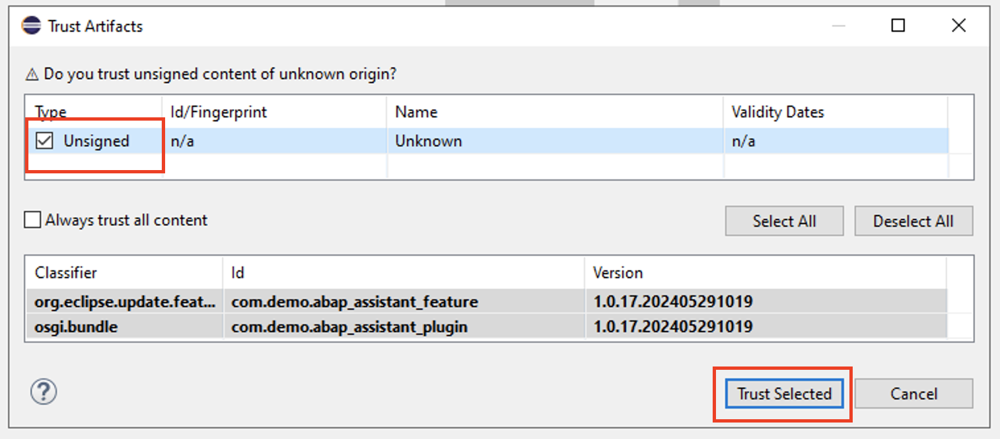

5. You will then see a dialog box asking you to restart Eclipse. Choose **Restart Now**.
After the Eclipse has restarted, you can see a menu bar at the top called **Ask Bedrock** with two submenus – **ABAP Code Assistant** and **ABAP Documentation Assistant**

    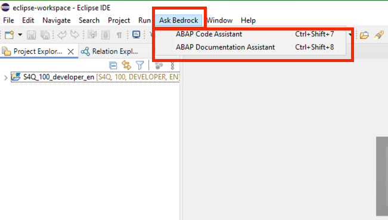

### Plugin Configuration
Before using ABAP Assistant plugin , you need to set up the plugin preferences in the Eclipse IDE. Choose **Windows -> Preferences** (on Windows), or **Eclipse -> Settings** (on MacOS) to bring up the preferences dialog page of Eclipse. In the left pane , choose **SAP ABAP Assistant**. Input the following settings :

**Authentication Configurations:**
Select either the `IAM Identity Center` or `IAM Roles Anywhere` option. 
* IAM Identity Center 
  * **AWS Profile** – Enter the name of the AWS profile `abap-assistant` that you created 
* IAM Roles Anywhere 
  * **PKCS12 Certificate** - Choose Browse and select the PKCS12 certificate from the file system.
  
  * **PKCS12 Key Alias** - Enter the alias of the X.509 certificate
  
  * **PKCS12 KeyStore Password** - Enter the keystore password
  
  * **Trust Anchor** - Enter the ARN of the Trust anchor
  
  * **Profile ARN** - Enter the profile ARN
  
  * **Role ARN** - Enter the IAM Role ARN

**General Configurations:**
* **AWS Region** – Enter `us-east-1`. Refer this [documentation](https://docs.aws.amazon.com/AWSEC2/latest/UserGuide/using-regions-availability-zones.html#concepts-available-regions) for list of AWS region codes. 

* **Model ID** – Enter the model id of supported foundation models mentioned in the section [AWS account requirements](#aws-account-requirements). For e.g. Enter `us.anthropic.claude-3-7-sonnet-20250219-v1:0`. Refer [this documentation](https://docs.aws.amazon.com/bedrock/latest/userguide/model-ids.html) for list of Amazon bedrock Model IDs. Refer [this documentation](https://docs.aws.amazon.com/bedrock/latest/userguide/inference-profiles-support.html#inference-profiles-support-system) for cross region inference profiles.

* **Prompt for ABAP Code** – The prompt for generating ABAP code is prepopulated. If required, you can change the prompt as per your requirements.

* **Prompt for Documentation** – The prompt for generating ABAP documentation is prepopulated. If required, you can change the prompt as per your requirements.

* **Temperature** – Controls the randomness. Range 0-1
  
* **Top P** – Controls the randomness. Range 0-1
  
* **Maximum length** - Limit the response by specifying the maximum length.

The following screenshot shows the SAP ABAP Assistant plugin preferences page.

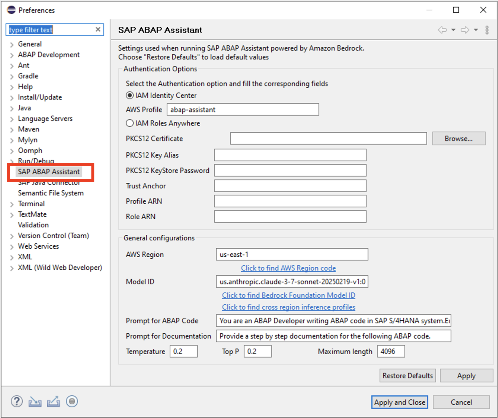

## Running the Guidance

### Generate ABAP Documentation
To generate the documentation, open the ABAP program `RH_GET_ADDRESS` in Eclipse and select all the lines of ABAP code. Then select **Ask Bedrock -> ABAP Documentation Assistant**. 

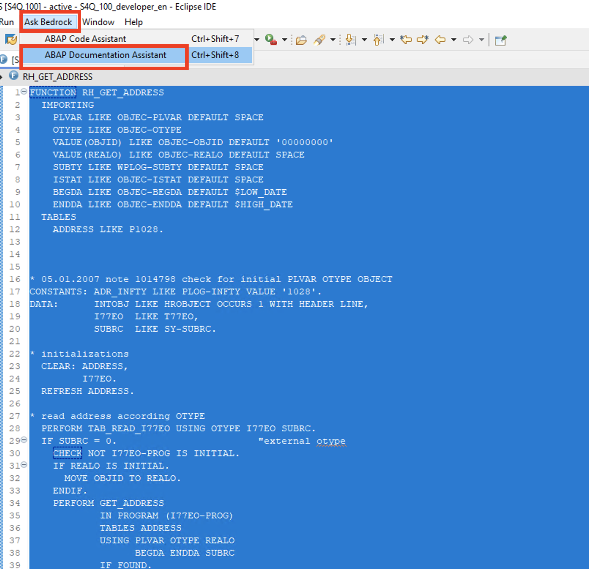

You can see the ABAP documentation for the selected lines of ABAP code in a console named **BEROCK_ABAP_CONSOLE** at the bottom of the eclipse IDE. You will see the documentation that resembles the example in the following screenshot.

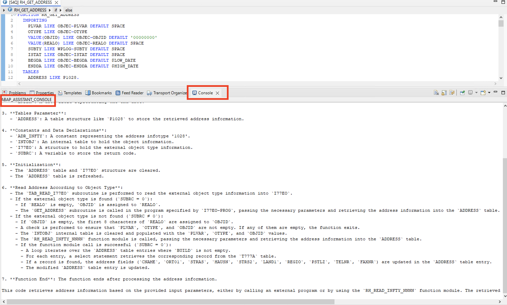

### Generate ABAP Code
In the ABAP perspective of Eclipse, open an existing ABAP program or create a new ABAP program. Enter the below prompts to generate ABAP code to retreive and display the material data from table MARA present in SAP S/4HANA system.
```
* Define a structure ty_material with fields MATNR MTART BRGEW GEWEI
* Define a table lt_material from ty_material
* Select MATNR MTART BRGEW GEWEI from table MARA into lt_material
* Display data in ALV format using CL_SALV_TABLE with appropriate parameters

```
In the Eclipse editor, select the lines of written text using your cursor and then select **Ask Bedrock -> ABAP Code Assistant** 

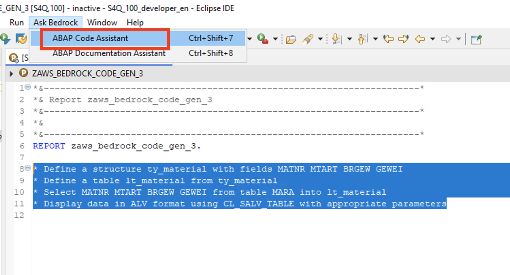

The ABAP assistant plugin will generate ABAP code after the last line of comment. You will see the generated ABAP code resembles the example in the following screenshot. 

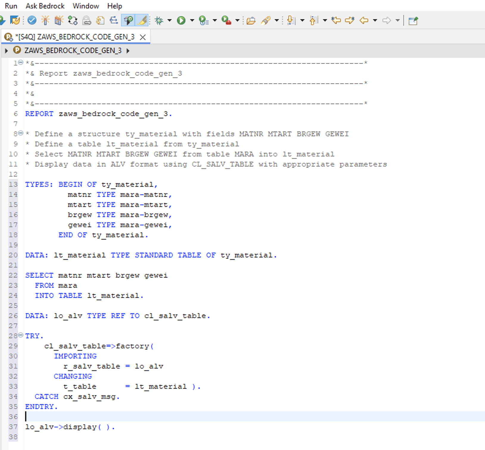


## Next Steps

You can modify the source code as per your requirements and generate a new version of the plugin. For example, you can add support to an additional foundation model (for e.g. Cohere Command). You can create a custom model by training a foundation model using Amazon Bedrock and then input the custom model ID in the ABAP Assistant plugin preferences in Eclipse.

1. Clone the GitHub repository to access the code. 
```
git clone https://github.com/aws-solutions-library-samples/guidance-for-improving-application-development-productivity-with-the-sap-abap-assistant-on-aws.git
cd ./guidance-for-improving-application-development-productivity-with-the-sap-abap-assistant-on-aws
```

2. Download and install **[Eclipse IDE for Eclipse Committers](https://www.eclipse.org/downloads/packages/)** with version 2023-09 and above.

3. Import the source code in Eclipse IDE for Eclipse Committers. Choose `File -> Import -> Maven -> Existing Maven projects`. 

    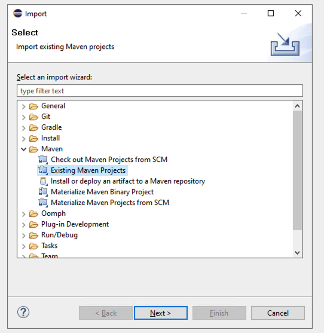

4. Browser to the `source` folder which has the downloaded source code. Choose **Finish**. 

    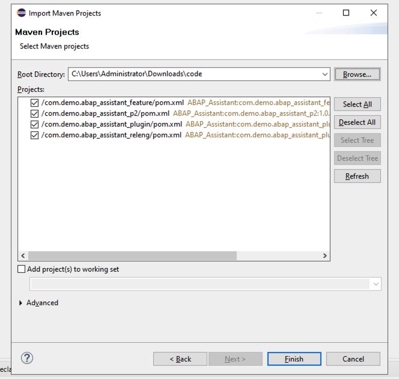

5. The imported projects can be seen in the Package Explorer view in Eclipse IDE for Eclipse Committers.

    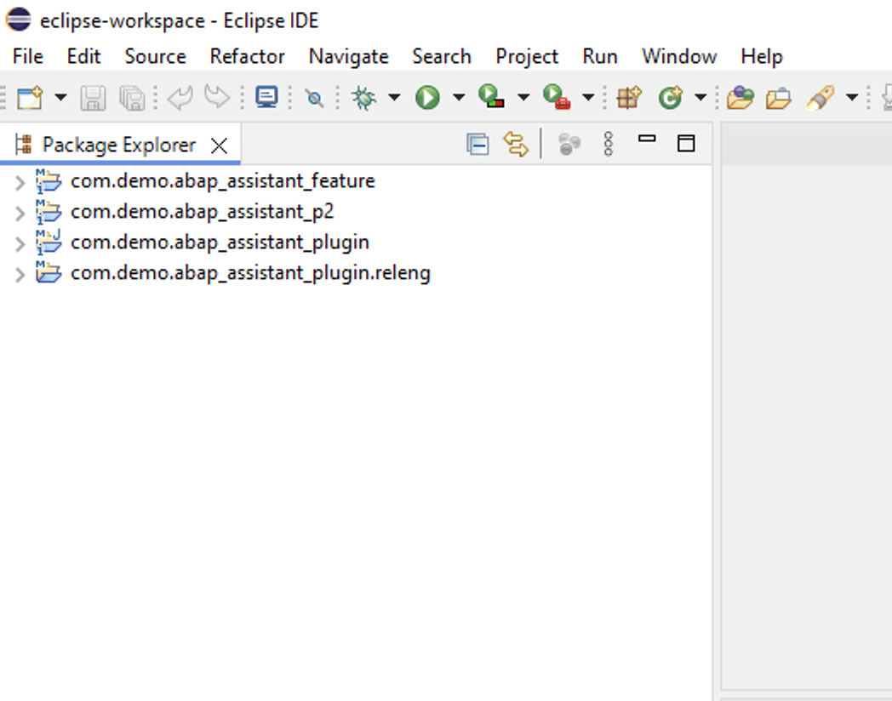

6. Make the required code changes as per your requirements in the project `com.demo.abap_assistant_plugin`. 

7. Update the Plugin version in `com.demo.abap_assistant_plugin -> plugin.xml` and in `com.demo.abap_assistant_feature -> feature.xml`

    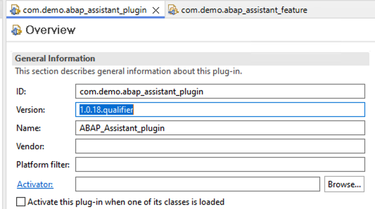

    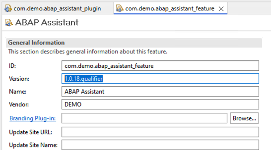

8. To generate a new version, right click on  `com.demo.abap_assistant_plugin.releng -> Run As -> Maven Build`. In the **Goals** enter `tycho-versions:update-pom` and Choose **Run**.

    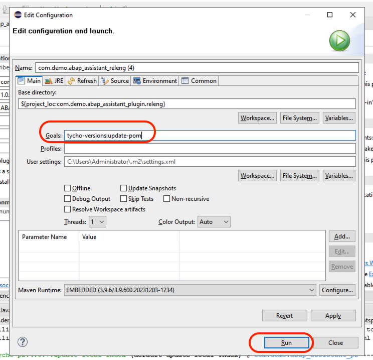

9. Right click on `com.demo.abap_assistant_plugin.releng -> Run As -> Maven Build`. In the **Goals** enter `clean install` and  choose **Run**.

    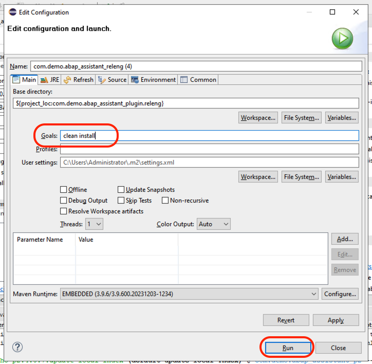

    You should see a log resembling the below screenshot in the console 

    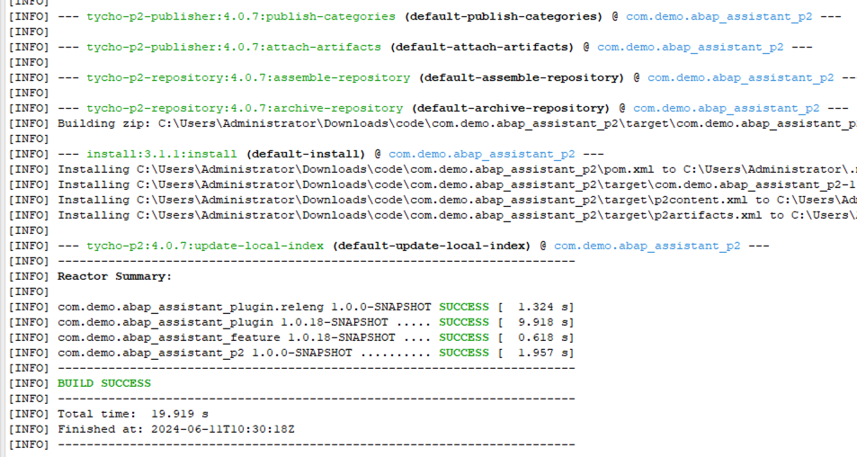

10. The plugin will be generated in `com.demo.abap_assistant_p2 -> target -> repository` folder.

    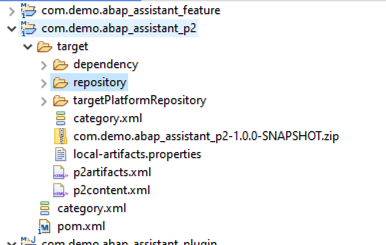

11. You can install or update to the new version of the plugin in by selecting **Help -> Install New Software** in Eclipse and pointing to the `repository` folder. Alternatively, you can zip the contents under `repository` folder and point to the zip file.

    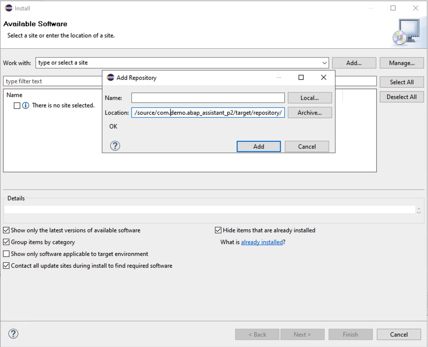

## Cleanup

### Uninstall SAP ABAP Assistant Plugin
If you want to uninstall the ABAP Assistant from Eclipse, proceed with the below steps:

1. In Eclipse IDE, choose **Help -> About Eclipse IDE** (on Windows), or **Eclipse -> About Eclipse** (on MacOS) and then choose **Installation Details** to list the installed softwares.

    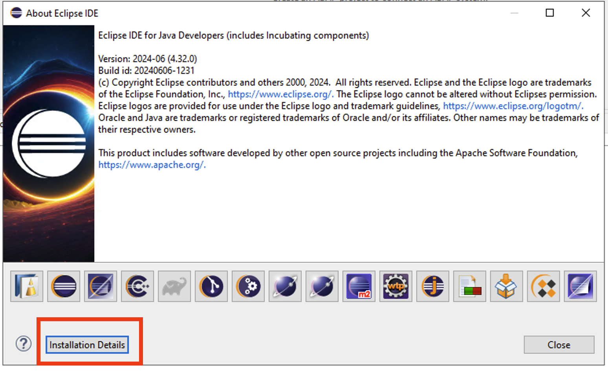

2. Select **ABAP Assistant** from the list, and then choose **Uninstall**

    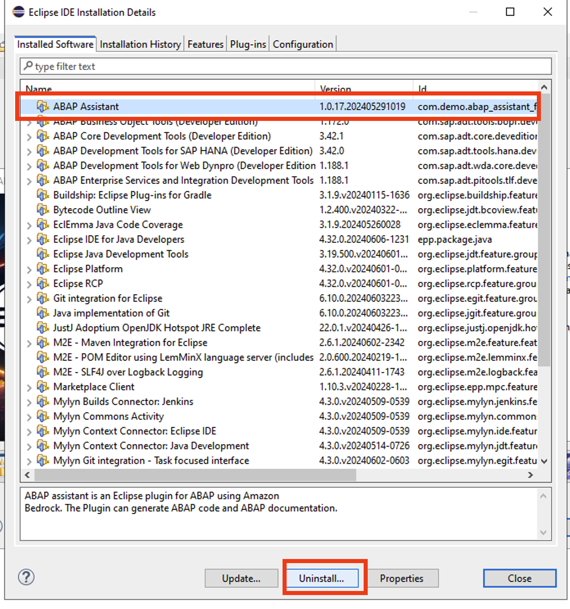

3. In the subsequent screen, choose **Finish** to uninstall the ABAP Assistant Plugin. You will then see a dialog box asking you to restart Eclipse. Choose **Restart Now**. 
    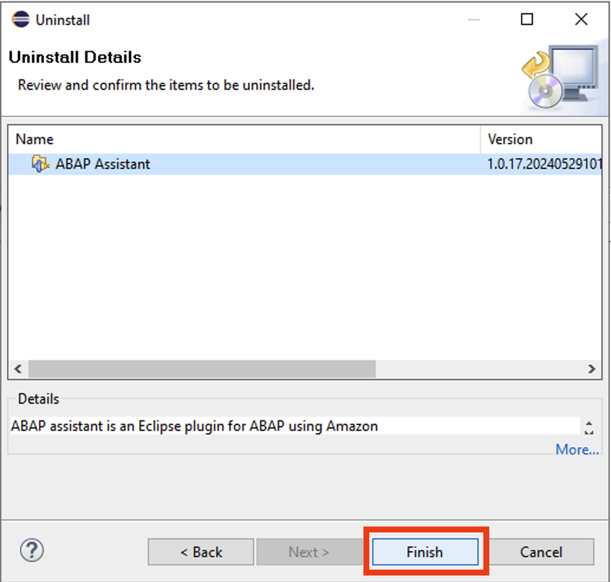

### AWS resources
1. Remove the permission set `ABAPAssistantAccess` from all AWS accounts that use the permission set. Refer this [link](https://docs.aws.amazon.com/singlesignon/latest/userguide/howtoremovepermissionset.html) for the steps to be followed.

2.  You can delete the permission set manually or by deleting the entire AWS CloudFormation stack.

 - If you want to delete the entire stack using the CloudFormation console:
    - Sign in to the AWS CloudFormation console
    - Select the Stack `sap-abap-assistant` and click on **delete**.


## Notices

*Customers are responsible for making their own independent assessment of the information in this Guidance. This Guidance: (a) is for informational purposes only, (b) represents AWS current product offerings and practices, which are subject to change without notice, and (c) does not create any commitments or assurances from AWS and its affiliates, suppliers or licensors. AWS products or services are provided “as is” without warranties, representations, or conditions of any kind, whether express or implied. AWS responsibilities and liabilities to its customers are controlled by AWS agreements, and this Guidance is not part of, nor does it modify, any agreement between AWS and its customers.*

## Authors

Adren D Souza